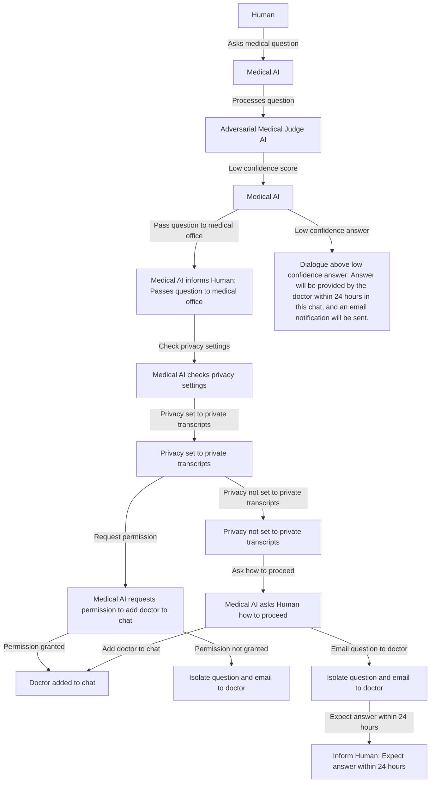

```mermaid
graph TD;
    A[Human] -->|Asks medical question| B[Medical AI];
    B -->|Processes question| C[Adversarial Medical Judge AI];
    C -->|Low confidence score| D[Medical AI];
    D -->|Pass question to medical office| E[Medical AI informs Human: Passes question to medical office];
    E -->|Check privacy settings| F[Medical AI checks privacy settings];
    F -->|Privacy set to private transcripts| G[Privacy set to private transcripts];
    G -->|Request permission| H[Medical AI requests permission to add doctor to chat];
    H -->|Permission granted| I[Doctor added to chat];
    H -->|Permission not granted| J[Isolate question and email to doctor];
    G -->|Privacy not set to private transcripts| K[Privacy not set to private transcripts];
    K -->|Ask how to proceed| L[Medical AI asks Human how to proceed];
    L -->|Add doctor to chat| I[Doctor added to chat];
    L -->|Email question to doctor| M[Isolate question and email to doctor];
    M -->|Expect answer within 24 hours| N[Inform Human: Expect answer within 24 hours];
    D -->|Low confidence answer| O[Dialogue above low confidence answer: Answer will be provided by the doctor within 24 hours in this chat, and an email notification will be sent.];
```