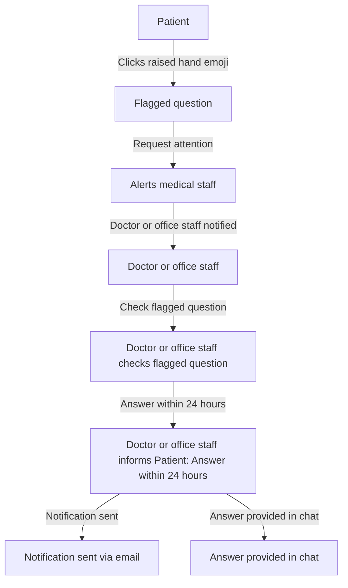

```mermaid
graph TD;
    A[Patient] -->|Clicks raised hand emoji| B[Flagged question];
    B -->|Request attention| C[Alerts medical staff];
    C -->|Doctor or office staff notified| D[Doctor or office staff];
    D -->|Check flagged question| E[Doctor or office staff checks flagged question];
    E -->|Answer within 24 hours| F[Doctor or office staff informs Patient: Answer within 24 hours];
    F -->|Notification sent| G[Notification sent via email];
    F -->|Answer provided in chat| H[Answer provided in chat];
```