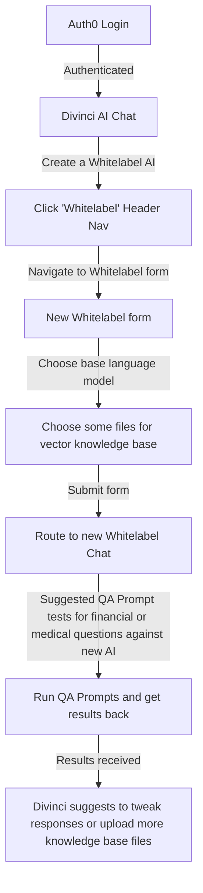

```mermaid
graph TD;
    A[Auth0 Login] -->|Authenticated| B[Divinci AI Chat];
    B -->|Create a Whitelabel AI| C["Click 'Whitelabel' Header Nav"];
    C -->|Navigate to Whitelabel form| D[New Whitelabel form];
    D -->|Choose base language model | E[Choose some files for vector knowledge base];
    E -->|Submit form| F[Route to new Whitelabel Chat];
    F -->|Suggested QA Prompt tests for financial or medical questions against new AI| G[Run QA Prompts and get results back];
    G -->|Results received| H[Divinci suggests to tweak responses or upload more knowledge base files];
```